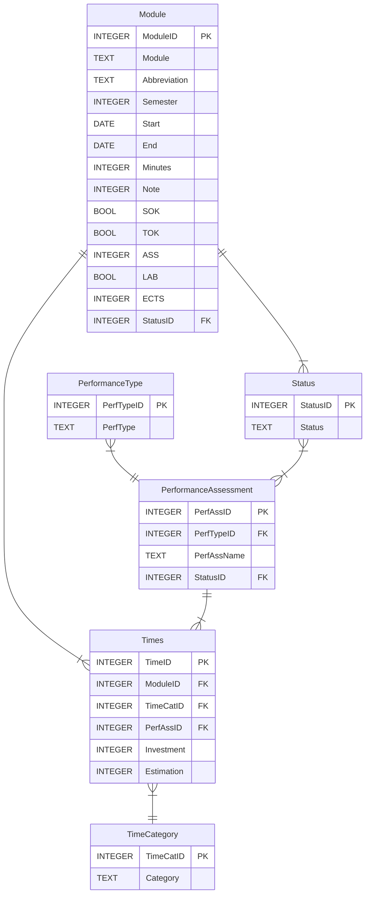

# Branch "Redesign-Database"
See [Issue #15](https://github.com/Enidable/AkademeMateQt/issues/15)

Cleanup note:
Branch already merged. Left for Documentation.
Setup for standard AkademMate database can be created from file data/CreateTables.sql
## Database structure:

